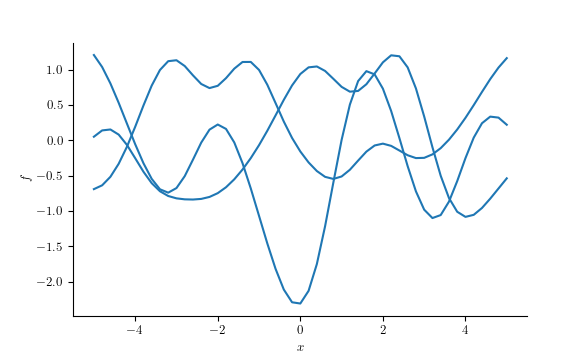
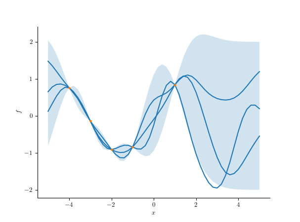

# 高斯过程

## 什么是高斯过程

&emsp;&emsp;我们知道长度为$N$的高斯随机向量$\pmb{f}=[f_1,f_2,...,f_n]$，它的期望和方差分别为$\mathbb{E}[\pmb{f}]=\pmb{\mu}$，和$\pmb{\Sigma}=\text{cov}(\pmb{f})$。现考虑一个函数$f:\mathcal{X}\rightarrow\mathbb{R}$，在一输入集$\mathcal{X}=\{\pmb{x}_n\}_{n=1}^N$的估值。令$\pmb{f}_X=[f(\pmb{x}_1),f(\pmb{x}_2),...,f(\pmb{x}_N)]$为未知函数在这些点的函数估值。

&emsp;&emsp;如果$\pmb{f}_X$是任何$N$个点的的联合高斯分布，则$f:\mathcal{X}\rightarrow \mathbb{R}$是一个**高斯过程**。该过程由均值函数和协方差函数定义，记为，

$$
\begin{split}
f(\pmb{x})&\sim \text{GP}(\pmb{m}(\pmb{x}),\pmb{K}(\pmb{x},\pmb{x}'))\\
\pmb{m}(\pmb{x})&=\mathbb{E}[f(\pmb{x})]\\
\pmb{K}(\pmb{x},\pmb{x}'))&=\mathbb{E}\left[ (f(\pmb{x})-\pmb{m}(\pmb{x}))(f(\pmb{x}')-\pmb{m}(\pmb{x}')^\top \right]
\end{split}
$$(gp-def)

这意味着，对于有限集$X=\{\pmb{x}_1,...,\pmb{x}_N\}$，我们可以得到以下知识，

$$
\begin{split}
p(f_{X}|X)&=\mathcal{N}(\pmb{f}_{X}|\pmb{\mu}_X,\mathcal{K}_{XX})\\
\pmb{\mu}_X&=[\pmb{m}(\pmb{x}_1),\pmb{m}(\pmb{x}_2),...,\pmb{m}(\pmb{x}_N)]\\
\mathcal{K}_{XX}(i,j)&=\pmb{K}(\pmb{x}_i,\pmb{x}_j)\\
\end{split}
$$(gp-knowledge)


&emsp;&emsp;(一)**高斯过程的作用**

&emsp;&emsp;高斯过程可以定义为**函数的先验**。我们可以在任何点集上计算该先验。然而要从数据学习函数，我们需要使用从似然函数来更新先验。一般来说，我们有观察数据样本$\mathcal{D}=\{(\pmb{x}_i,y_i):i=1,2,...,N\}$，其中$y_i\sim p(y|f(\pmb{x}_i))$。如果使用一个高斯似然函数，则可以计算$p(f|\mathcal{D})$的后验闭式形式。对于其它形式的似然函数，则需要使用近似推断。

下图为一个示例以及相应的python核心代码。

:::{figure-md}
{width=400px}

高斯过程先验示例，一个样本即为一个函数。
:::

```python
    kernel = kernels.ExpSquared(scale=1.0)
    gp = GaussianProcess(kernel, data["x"], diag=1e-8 + data["noise"])
    samples = gp.sample(key, shape=(data["n_samples"],))
    plt.figure()
    plt.plot(x, samples.T, color=c_0)
    plt.xlabel("$x$")
    plt.ylabel("$f$")
```

&emsp;&emsp;(二)**高斯似然**

&emsp;&emsp;给定一个测试集$\pmb{X}_*(N_*\times D)$，我们需要预测函数输出$f_*=[f(\pmb{x}_1),...,f(\pmb{x}_N)$。由GP的定义可知，联合分布为，

$$
\begin{split}
\begin{bmatrix}\pmb{f}_X\\ \pmb{f}_*\end{bmatrix}&\sim\mathcal{N}\left( \begin{bmatrix}\pmb{\mu}_X\\ \pmb{\mu}_*\end{bmatrix} , \begin{bmatrix}\pmb{K}_{XX}&\pmb{K}_{X*}\\ \pmb{K}_{*X}&\pmb{K}_{**}\end{bmatrix}\right)\\
\pmb{\mu}_X&=[\pmb{m}(\pmb{x}_1),\pmb{m}(\pmb{x}_2),...,\pmb{m}(\pmb{x}_N)]\\
\pmb{\mu}_*&=[\pmb{m}(\pmb{x}_1),\pmb{m}(\pmb{x}_2),...,\pmb{m}(\pmb{x}_{N*})]\\
&\pmb{K}_{XX}维度为N\times N\\
&\pmb{K}_{X*}维度为N\times N*\\
&\pmb{K}_{**}维度为N*\times N*\\
\end{split}
$$(gp-predict)

由后验公式可知，

$$
\begin{split}
p(f_*|X_*,\mathcal{D})&=\mathcal{N}(\pmb{f}_*|\pmb{\mu}_{*|X},\pmb{\Sigma}_{*|X})\\
\pmb{\Sigma}_{*|X}&=\pmb{K}_{**}-\pmb{K}_{X*}^\top \pmb{K}_{XX}^{-1}\pmb{K}_{X*}\\
\pmb{\mu}_{*|X}&=\pmb{\mu}_*+\pmb{K}_{X*}^\top \pmb{K}_{XX}^{-1}(\pmb{f}_X-\pmb{\mu}_X)
\end{split}
$$(gp-posterior)


下图为一个示例以及相应的python核心代码。

:::{figure-md}
{width=400px}

高斯过程后验预测示例
:::

```ptyhon
    kernel = kernels.ExpSquared(scale=1.0)
    gp = GaussianProcess(kernel, data["x_train"], diag=1e-8 + data["noise"])
    pred_gp = gp.condition(data["y_train"], data["x_test"]).gp
    samples = pred_gp.sample(key, shape=(data["n_samples"],))
    mean = pred_gp.mean
    std = pred_gp.variance**0.5

    plt.figure()
    plt.plot(data["x_test"], samples.T, color=c_0)
    plt.scatter(data["x_train"], data["y_train"], color=c_1, zorder=10, s=5)
    plt.fill_between(data["x_test"].flatten(), mean - 2 * std, mean + 2 * std, alpha=0.2)
    plt.xlabel("$x$")
    plt.ylabel("$f$")
```

## Mercer核

&emsp;&emsp;高斯过程的泛化特性归结为我们如何编码两个输入向量相似性的先验知识。如果我们知道$\pmb{x}_i$和$\pmb{x}_j$相似，则模型可以这两处的的输出尽可能的相似。为了定义相似性，可以使用核函数。这里只介绍正定核也称为**Mercer核**。这是一个对称函数$\mathcal{K}:\mathcal{X}\times\mathcal{X}\rightarrow\mathbb{R}^+$，且满足，

$$
\sum_{i=1}^N\sum_{j=1}^N\mathcal{K}(\pmb{x}_i,\pmb{x}_j)c_ic_j\ge 0
$$(mercer-kernel-def)

对于任意$N$个数据点$\pmb{x}_i\in\mathcal{X}$集合，以及任意实数$c_i\in\mathbb{R}$。如果$\mathcal{K}(\pmb{x}_i,\pmb{x}_j)>0$，则等式成立只有当所有$c_i=0$。