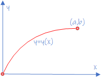
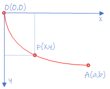

# 再生核希尔伯特空间

## 基本概念

### 泛函

&emsp;&emsp;首先来了解什么是泛函。**泛函**(Functional)通常是指定义域为函数集，而值域为实数或复数的映射。换句话说，泛函是输入为函数，输出为标量的映射。

>**定义0 (泛函)**. 假设有映射$F[y]: \mathcal{C}\rightarrow \mathbb{B}$，其中$\forall y(x)\in \mathcal{C}$，$\mathcal{C}$为函数集, $y$为$x$的函数，$x\in\mathcal{X}$,数集$\mathbb{B}\subseteq \mathbb{R}$，则称$F$是$y(x)$的泛函。一般记为积分形式

$$
J[y(x)]=\int_{x_0}^{x_1}F(x,y,y')dx
$$

&emsp;&emsp;可以看出泛函是一种定义域为函数集，而值域为实数或复数的映射。

- **例1**. 两点间直线距离最短问题.

&emsp;&emsp;如上图所示，从坐标原点$(0,0)$到点$(a,b)$的连接曲线为$y=y(x)$，曲线的弧长微分为$ds=\sqrt{1+\left( \frac{dy}{dx}\right)^2}dx$，总弧长为$s=\int_0^a (1+y'^2)^{1/2}dx$。可以看出$s$为一个标量，而等式右边为$y'(x)$的函数，即泛函，可记为$s(y')$。最终问题转化为：寻找曲线$y=y(x)$，使得泛函$s(y')$最小。

- **例2**. 最速降线问题

&emsp;&emsp;如上图所示，有一物体从原点$(0,0)$沿着曲线到达$A$点$(a,b)$，若忽略摩擦力，那么沿着什么形状的曲线路径下降时间最短？物体从点$(0,0)$运动到$P$点时，失去的势能为$mgy$，获得的动能为$mv^2/2$，由能量守恒定律可知，

$$
v^2=2gy
$$

在$P$点处，物体的运动速度为，

$$
v=\frac{ds}{dt}=\frac{\sqrt{1+y'^2}dx}{dt}
$$

其中$s$表示曲线弧长，$t$为运动时间。由上式可知，$dt=\frac{\sqrt{1+y'^2}dx}{v}$，将$v$代入，可得，

$$
dt=\sqrt{\frac{1+y'^2}{2gy}}dx
$$

最终可得物体从$O$点运动到$A$点所需的时间为(等式两边同时积分)，

$$
\boxed{t=\int_0^a\sqrt{\frac{1+y'^2}{2gy}}dx=J[y]}
$$

物体由$O$点运动到$A$点所需的时间$t$是$y(x)$的函数。问题最终转变为满足条件$y(0)=0,y(a)=b$的所有连续函数$y=y(x)$中，找出一个函数$y(x)$使得$J[y]$最小。

---

#### 泛函极值求解--变分法

&emsp;&emsp;对于引入的泛函问题$J[y]$，如何求其函数变时的极值$\hat{y}(x)$呢？一个可行的办法是使用变分法(Calculus of Variations)。传统的微积分中一个基本问题是寻找变最$x$的值使得函数$y(x)$的值大化(或最小化)。类似的，变分法能够寻找到一个函数$y(x)$使得泛函$F[y]$的值最大（或最小）。

&emsp;&emsp;传统的函数中，可以对变量$x$的微小变化$\epsilon$展开函数，即

$$
y(x+\epsilon)=y(x)+\frac{dy}{dx}\epsilon+O(\epsilon^2)
$$

类似的，对函数$y(x)$的微小变化$\epsilon \eta(x)$，可以展开泛函，即

$$
F[y(x)+\epsilon \eta(x)]=F[y(x)]+\epsilon\int\frac{\delta F}{\delta y(x)}\eta(x)dx+O(\epsilon^2)
$$

其中，$\frac{\delta F}{\delta y(x)}$为泛函$F[y]$关于$y(x)$的导数。上式可以看成函数展开的一个自然扩展。可以看出，泛函$F[y]$依赖$y$在所有点$x$的值。

&emsp;&emsp;现考虑更一般的泛函$F[y]$，

$$
F[y]=\int G(y(x),y'(x),x)dx
$$

其中，$y(x)$的值在积分边界上假定是固定的。现在对函数$y$的微小变化$\epsilon \eta(x)$，可以得到

$$
F[y(x)+\epsilon\eta(x)]=F[y(x)]+\epsilon\int\left\{\frac{\partial G}{\partial y}\eta(x)+\frac{\partial G}{\partial y'}\eta'(x)\right\}dx+O(\epsilon^2)
$$

注意：$\delta y=\epsilon \eta(x), \delta y'=\epsilon \eta'(x)$。对等式右边第二项使用分部积分可得，

$$
\begin{split}
\epsilon\int\frac{\partial G}{\partial y'}\eta'(x)dx&=\epsilon\int\frac{\partial G}{\partial y'}d\eta(x)\\
&=\left.\frac{\partial G}{\partial y'}\delta y\right|_{\textrm{boundary}_{\textrm{inf}}}^{\textrm{boundary}_{\textrm{sup}}}-\epsilon\int\eta(x)\frac{d}{dx}\left(\frac{\partial G}{\partial y'}\right)\\
&=-\epsilon\int\eta(x)\frac{d}{dx}\left(\frac{\partial G}{\partial y'}\right)\qquad (\textrm{在积分区域的边界}\delta y=0 )
\end{split}
$$

将上式结果代回，可得

$$
F[y(x)+\epsilon\eta(x)]=F[y(x)]+\epsilon\int\left\{\frac{\partial G}{\partial y}-\frac{d}{dx}\left(\frac{\partial G}{\partial y'}\right)\right\}\eta(x)dx+O(\epsilon^2)
$$

若泛函在$y(x)$取得极值，则必有，

$$
\boxed{\frac{\partial G}{\partial y}-\frac{d}{dx}\left(\frac{\partial G}{\partial y'}\right)=0}
$$

这便是变分法的核心公式，也称之为Euler-Lagrange方程。有了该公式，就可以找出所寻求的极值点$\hat{y}(x)$。一般来说，Euler方程是一个二阶微分方程，$y(x)$的通解中含有的两个待定常数刚好通过两个边界条件确定。

#### 含参变量的定积分

&emsp;&emsp;变分法中，对于泛函求导问题（求导与积分先后顺序问题），可以参考含变量的定积分。含变量的定积分一般具有如下形式，

$$
I(y)=\int_a^b f(x,y)dx
$$

>**定理1**. 若函数$f(x,y)$在闭区域$a\le x\le b,c\le y\le d$上连续，则$I[y]$在闭区域$c\le y\le d$连续。

>**定理2**.  若函数$f(x,y),f_y'(x,y)$都在闭区域$a\le x\le b,c\le y\le d$上连续，则$I[y]$在闭区域$c\le y\le d$上具有连续导数

$$
I'[y]=\int_a^b f'_y(x,y)dx
$$

证明过程可参考《数学分析》ISBN：9787040427806。

---

#### 例子

- **例1**. 求解两点间最短路径。

&emsp;&emsp;该问题的泛函已知为，

$$
s=\int_0^a (1+y'^2)^{1/2}dx
$$

使用变分法，令$G(y,y',x)=\sqrt{1+y'^2}$，使用Euler-Lagrange方程来寻找$s$有极值的函数$y(x)$。注意到，

$$
\frac{\partial G}{\partial y}=0,\quad\frac{\partial G}{\partial y'}=\frac{y'}{\sqrt{1+y'^2}}
$$

代入Euler-Lagrange方程，可知，

$$
\frac{d}{dx}\left(\frac{y'}{\sqrt{1+y'^2}} \right)=0
$$

解此微分方程，可知$y(x)$满足直线方程，即，

$$
\boxed{y=kx+c}
$$

通过边界点，可以计算出$k,c$。由此，通过变分法，我们得到了结论：两点之间直线距离最短。

- **例2**. 最速降线问题。

&emsp;&emsp;该问题的泛函上节已知为

$$
t=\int_0^a\sqrt{\frac{1+y'^2}{2gy}}dx
$$

利用变分法，令$G(y,y',x)=\sqrt{\frac{1+y'^2}{2gy}}$，可求得Euler-Lagrange方程的两个偏导数，

$$
\frac{\partial G}{\partial y}=-\frac12\sqrt{\frac{1+y'^2}{y^3}},\quad\frac{\partial G}{\partial y'}=\frac{y'}{\sqrt{y(1+y'^2)}}
$$

可得Euler方程如下，

$$
\frac12\sqrt{\frac{1+y'^2}{y^3}}+\frac{d}{dx}\left(\frac{y'}{\sqrt{y(1+y'^2)}}\right)=0
$$

注意到，

$$
\frac{d}{dx}\left[G-y'\frac{\partial G}{\partial y'}\right]=y'\frac{\partial G}{\partial y}+y''\frac{\partial G}{\partial y'}-y''\frac{\partial G}{\partial y'}-y'\frac{d}{dx}\left(\frac{\partial G}{\partial y'}\right)=0
$$

因此有，

$$
G-y'\frac{\partial G}{\partial y'}=C
$$

做三角代换可得，

$$
y=2r\sin^2\frac{\theta}{2}=r(1-\cos\theta)
$$

上式对$\theta$求导，可得$x=r(\theta-\sin\theta)+x_0$。根据曲线过原点$(0,0)$及$(p,q)$可解出$x_0=0$以及$r$，最终结果为，

$$
\boxed{\left\{\begin{array}{l}x=r(\theta-\sin\theta)\\ y=r(1-\cos\theta)\end{array} \right.}
$$

[参考1](https://zhuanlan.zhihu.com/p/139018146)

---
## 线性算子

>**定义1 (线性算子)**. 一个函数$A:\mathcal{F}\rightarrow \mathcal{G}$称之为线性算子，当且仅当以下条件成立：
>> - 齐次性(homogeneity): $A(\alpha f)=\alpha (Af),\quad \forall \alpha\in \mathbb{K},f\in \mathcal{F}$
>> - 可加性(additivity): $A(f+g)=Af+Ag,\quad\forall f,g\in\mathcal{F}$
>
>其中$\mathcal{F,G}$为定义在$\mathbb{K}$上的赋范向量空间（例如：$\mathcal{X}\subset \mathbb{R}\rightarrow \mathbb{R} $ 映射函数的Banach空间并定义$L_p$范数）。

&emsp;&emsp;**例1** 令$\mathcal{F}$为一个内积空间，对于$g\in\mathcal{F}$，算子$A_g :\mathcal{F}\rightarrow\mathbb{K}$， $A_g(f):=\langle f,g\rangle_\mathcal{F}$是一个线性算子。注意到算子$A_g$的像是一个潜在的域$\mathbb{K}$，而这正是定义在$\mathbb{K}$上的一个平凡的赋范线性空间(normed linear space over itself)。这样的标量值算子也称之为$\mathcal{F}$空间的泛函(functionals)。

>**定义2 (连续性)**. 一个函数$A:\mathcal{F}\rightarrow \mathcal{G}$在$f_0\subset \mathcal{F}$是连续的，如果对于任意$\epsilon >0$，总存在一个$\delta =\delta(\epsilon,f_0)>0$，满足

$$
\Vert f-f_0\Vert_\mathcal{F}<\delta,\quad \textrm{implies}\quad\Vert Af-Af_0\Vert_\mathcal{G}<\epsilon.
$$

&emsp;&emsp;当$A$在$\mathcal{F}$的每一个点都是连续的，则$A$在$\mathcal{F}$是**连续的**。换句话说，$\mathcal{F}$中的一个收敛序列映射到$\mathcal{G}$中的一个收敛序列。

&emsp;&emsp;**例子**. 对于$g\in\mathcal{F}, A_g:\mathcal{F}\rightarrow\mathbb{K}$，并且$A_g(f):=\langle f,g\rangle_\mathcal{F}$在$\mathcal{F}$是连续的。

$$
|A_g(f_1)-A_g(f_2)|=|\langle f_1-f_2,g\rangle_\mathcal{F}|\le \Vert g\Vert_{\mathcal{F}}\Vert f_1-f_2\Vert_\mathcal{F}
$$

>**定义3 (算子范数(Operator norm))**. 线性算子$A:\mathcal{F}\rightarrow\mathcal{G}$的算子范数定义为，

$$
\Vert A\Vert=\sup_{f\in\mathcal{F}}\frac{\Vert Af\Vert_\mathcal{G}}{\Vert f\Vert_\mathcal{F}}
$$

>**定义4 (有界算子(Bounded operator))**. 如果$\Vert A\Vert <\infty$，则称算子$A:\mathcal{F}\rightarrow\mathcal{G}$是有界算子。

&emsp;&emsp;可以看出$A$是有界算子当且仅当对于所有的$f\in\mathcal{F}$，存在一个非负实数$\lambda$，使之$\Vert Af\Vert_\mathcal{G}\le\lambda\Vert f\Vert_\mathcal{F}$成立，并且最小的$\lambda$恰好是算子范数。

&emsp;&emsp;有界算子可以重写为，

$$
\begin{split}
\frac{\Vert Af\Vert_\mathcal{G}}{\Vert f\Vert_\mathcal{F}}&\le\Vert A\Vert\\
\Vert Af\Vert_\mathcal{G}&\le\Vert A\Vert\Vert f\Vert_\mathcal{F}
\end{split}
$$

可以看出，$\mathcal{F}$的一个有界子集(bounded subset)映射到了$\mathcal{G}$的一个有界子集。

注意：在微积分中，一个有界函数是指其范围是是有界集合的函数。这个定义与上面的定义不同，上面的定义简单地说明$A$对$f$的影响是由$f$的范数的一些缩放所限制的。对于算子范数(operator norm)有一种有用的几何解释:$A$将$\mathcal{F}$中的封闭单位球映射到$\mathcal{G}$中的封闭球的一个子集，中心为$0\in\mathcal{G}$，半径为$\Vert A\Vert$。同时注意：任何赋范、有限维空间的线性算子是有界的。

>**定理**. 假设$(\mathcal{F},\Vert\cdot\Vert_\mathcal{F}), (\mathcal{G},\Vert\cdot\Vert_\mathcal{G})$是赋范线性空间，如果$L$是一个线性算子，则以下3个条件是等价的：
>>1. $L$是一个有界算子.
>>2. $L$在$\mathcal{F}$是连续的.
>>3. $L$在$\mathcal{F}$中一点(one point)是连续的.

>**定义5 (代数对偶(Algebraic dual))**. 如果$\mathcal{F}$是一个赋范空间，那么线性泛函$A:\mathcal{F}\rightarrow \mathbb{K}$的空间$\mathcal{F}'$称为$\mathcal{F}$的代数对偶空间(Algebraic dual)。

>**定义6 (拓扑空间对偶(Topological dual))**.
 如果$\mathcal{F}$是一个赋范空间，那么连续线性泛函$A:\mathcal{F}\rightarrow \mathbb{K}$的空间$\mathcal{F}'$称为$\mathcal{F}$的拓扑对偶空间(Topological dual)。

 &emsp;&emsp;在有限维空间，上述两个定义是一致的。但是在无限维空间不在适用。前面的例子已知，内积空间$\mathcal{F}$中形如$\langle \cdot,g\rangle_\mathcal{F}$的泛函是线性和连续的，也就是它们存在于$\mathcal{F}$的拓扑对偶空间$\mathcal{F}'$。这也显示如果$\mathcal{F}$是一个Hilbert空间，则$\mathcal{F}'$的所有元素都具有$\langle \cdot,g\rangle_\mathcal{F}$形式。

 >**定理 (Riesz representation)**. 在一个Hilbert空间$\mathcal{F}$， 所有的连续线性泛函$A$都存在$g_A\in \mathcal{H}$，具有$\langle \cdot,g_A\rangle_\mathcal{F}$的形式，使得$Af=\langle f,g_A \rangle_\mathcal{H}, \forall f\in \mathcal{H}$成立。

---
## 再生核Hilbert空间

### 求值泛函

&emsp;&emsp;令$\mathcal{H}$为一个从非空集$\mathcal{X}$到复数域$\mathbb{R}$的函数Hilbert空间。

&emsp;&emsp;一个特殊的泛函：求值泛函(Dirac evaluation functional).

> **定义1 (Evaluation Functional)**. Let $\mathcal{H}$ be a Hilbert space of functions $f:\mathcal{X}\rightarrow \mathbb{R}$, defined on a non-empty set $\mathcal{X}$. For a fixed $x\in\mathcal{X}$，map $\delta_x :\mathcal{H}\rightarrow\mathbb{R}$，$\delta_x :f\rightarrow  f(x)$ is called the (Dirac) evaluation functional at $x$.

显然，求值泛函$\delta_x$是一个线性泛函，因为对于$\forall f,g\in\mathcal{H}, \forall \alpha,\beta\in\mathbb{R}$以下等式成立，

$$
\delta_x(\alpha f+\beta g)=(\alpha f+\beta g)(x)=\alpha f(x)+\beta g(x)=\alpha \delta_x(f)+\beta\delta_x(g)
$$

&emsp;&emsp;因此，一个自然的问题就是泛函是否连续（等价于线性算子的有界性）？这正是RKHS是如何定义的。

>**定义2 (Reproducing kernel Hilbert space, RKHS)**. 一个从非空集$\mathcal{X}$到数域$\mathbb{R}$函数的Hilbert空间$\mathcal{H}$是一个RKHS空间，如果$\forall x \in \mathcal{X}, \delta_x$ 是连续的。

>**Coroallary ($\mathcal{H}$范数收敛隐含着逐点收敛)**. 如果两个函数RKHS范数收敛，则它们在每次一个点都收敛，即如果$\lim_{n\rightarrow \infty}\Vert f_n -f\Vert_{\mathcal{H}}=0$, 则有$\lim_{n\rightarrow\infty}f_n(x)=f(x), \forall x \in\mathcal{X}$。

&emsp;&emsp;证明. 对于任意$x\in\mathcal{X}$有，

$$
\begin{split}
|f_n(x)-f(x)|&=|\delta_x f_n -\delta_x f|\\
&\le \Vert\delta_x\Vert\Vert f_n-f\Vert_\mathcal{H}
\end{split}
$$

其中，$\Vert\delta_x\Vert$为求值泛函的范数（在RKHS的定义中，该算子是有界的）。

&emsp;&emsp;**例**. 如果不是一个RKHS，则范数收敛不一定隐含逐点收敛。令$\mathcal{H}=L_2([0,1])$，且度量为，

$$
\Vert f_1 -f_2\Vert_{\mathcal{H}}=\left(\int_0^1 |f_1(x)-f_2(x)|^2\right)^{1/2}
$$

考虑函数序列$\{q_n\}, q_n=x^n$，则有

$$
\begin{split}
\lim_{n\rightarrow \infty}\Vert q_n -0\Vert_{\mathcal{H}}&=\lim_{n\rightarrow\infty}\left(\int_0^1 x^{2n}dx\right)^{1/2}\\
&=\lim_{n\rightarrow \infty}\frac{1}{\sqrt{2n+1}}\\
&=0
\end{split}
$$

且有$q_n(1)=1,\forall n$。也就是说求值泛函在点1是不连续的。

---
### 再生核

&emsp;&emsp;下面从核函数的角度来探讨RKHS。

> **定义3 (Reproducing kernel Hilbert space, RKHS)**. 设$\mathcal{H}$是一个定义在非空集合$\mathcal{X}$上的函数$f:\mathcal{X}\rightarrow \mathbb{R}$构成的Hilbert空间，若函数$\kappa:\mathcal{X}\times\mathcal{X}\rightarrow\mathbb{R}$满足：
>1. $\forall x \in \mathcal{X},\kappa(\cdot,x)\in\mathbb{R}$;
>2. $\forall x \in \mathcal{X},\forall f \in \mathcal{H},\langle f,\kappa(\cdot,x)\rangle_\mathcal{H}=f(x)$;  （**the reproducing property, 再生性**）
>3. 特别地，$\forall x,y\in\mathcal{X}$，有$\kappa(x,y)=\langle \kappa(\cdot,x),\kappa(\cdot,y)\rangle_\mathcal{H}$;
>
>其中，$\langle\cdot,\cdot\rangle_\mathcal{H}$是内积。则称$k$为$\mathcal{H}$的再生核函数，$\mathcal{H}$为再生核Hilbert空间。

&emsp;&emsp;这个定义产生了很多的疑问。核函数与RKHS的定义有什么关系？这个核函数存在吗？它有什么属性？首先来回答前两个问题。

>**定理 (核函数存在性)**. $\mathcal{H}$是一个再生核希尔伯特空间(即，其求值函数$\delta_x$是连续的线性算子)，当且仅当$\mathcal{H}$具有再生核。

&emsp;&emsp;**证明**. 给定一个Hilbert空间$\mathcal{H}$，并具有再生属性$\langle f,k(\cdot,x)\rangle_\mathcal{H}=f(x)$，则有

$$
\begin{split}
|\delta_x[f]|&=|f(x)|\\
&=|\langle f,k(\cdot,x)\rangle_\mathcal{H}|\\
&\le \underbrace{\Vert k(\cdot,x)\Vert_\mathcal{H}\cdot\Vert f\Vert_\mathcal{H}}_{\textrm{Cauchy-Schwarz inequality}}\\
&=k(x,x)^{1/2}\cdot\Vert f\Vert_\mathcal{H}
\end{split}
$$

因此，求值泛函$\delta_x$是一个有界线性算子。

&emsp;&emsp;下面来证明另一个方向。先定义$\mathcal{H}$的对偶空间$\mathcal{H}'$，假设$\delta_x \in \mathcal{H}' :\mathcal{F}\rightarrow \mathbb{K} $是一个有界线性算子。由Riesz表示定理可以得知，必然存在一个元素$f_{\delta_x}\in\mathcal{H}$满足，

$$
\delta_x [f]=\langle f,f_{\delta_x}\rangle_{\mathcal{H}}
$$

且存在一个等距反线性同构$I:\mathcal{H}'\rightarrow\mathcal{H}$，使之$\delta_x\rightarrow f_{\delta_{x}}$成立。在$\mathcal{H}$定义一个再生核，

$$
k(x,x')=\langle \delta_x,\delta_{x'}\rangle_{\mathcal{H}'}
$$

这给了我们一个规范的特征映射$k(\cdot,x')=I\delta_{x'}$，因此可知

$$
k(x,x')\underbrace{=\langle \delta_x,\delta_{x'}\rangle_{\mathcal{H}'}}_{(1)}\underbrace{=\langle I\delta_x,I\delta_{x'}\rangle_{\mathcal{H}}}_{(2)}=\delta_x (I\delta_{x'})=I\delta_{x'}(x)
$$

其中等式(1)使用了反线性等距(anti-linear isometry)，等式(2)使用了$I\delta_x = f_{\delta_x}$。因此，这个规范特征映射再生属性，

$$
f(x')=\delta_{x'}f=\langle f,I\delta_{x'}\rangle_\mathcal{H}=\langle f,k(\cdot,x')\rangle_\mathcal{H}
$$

因此，$k$是一个再生核。

&emsp;&emsp;从上述定理可以看出，$k(\cdot,x)$实际上是在$x$点求值算子的一种表示。

#### RKHS具体化

>**定义 (正定函数)**. 一个函数$h:\mathcal{X}\times\mathcal{X}\rightarrow\mathbb{K}$是正定的，如果$\forall n\ge 1,\forall a_i \in \mathbb{K}, x_i\in\mathcal{X}$,

$$
\sum_{i=1}^n\sum_{j=1}^n a_ia_jh(x_i,x_j)\ge 0
$$

>若等号成立仅当$a_i,a_j=0$，则称函数$h(\cdot,\cdot)$是严格正定的（stricklly positive definite）。

&emsp;&emsp;根据上述定义可知，任意内积函数是一个正定函数。更一般地有如下引理。

>**Lemma (核函数一定是正定函数)**. 若$\mathcal{F}$是一个Hilbert空间（RKHS不是必要的）,$\mathcal{X}$是一个非空集合且有映射$\phi :\mathcal{X}\rightarrow \mathcal{F}$，则$h(x,y)=\langle \phi(x),\phi(y)\rangle_\mathcal{F}$是一个正定函数(positive definite function)。

&emsp;&emsp;**证明**.

$$
\begin{split}
\sum_{i=1}^n\sum_{j=1}^n a_ia_jh(x_i,x_j)&=\sum_{i=1}^n\sum_{j=1}^n \langle a_i\phi(x_i), a_j\phi(x_j)\rangle\\
&=\left\Vert \sum_{i=1}^n a_i\phi(x_i) \right\Vert_{\mathcal{F}}^2
\end{split}
$$

> **Corollary**. 再生核函数是正定核函数。

&emsp;&emsp;**证明**. 对于RKHS空间的一个再生核$k$有，$k(x,y)=\langle k(\cdot,x),k(\cdot,y)\rangle_\mathcal{H}$，容易验证$\phi : x\rightarrow k(\cdot,x)$。

&emsp;&emsp;正定核函数是否也是再生核函数？

>**定理 (Moore-Aronszajn)**. 正定核函数$k$唯一对应一个再生核Hilbert空间，且$k$就是其核函数。

&emsp;&emsp;有了Moore-Aronszajn定理，可以只关注于构造对称、正定的函数即可。

[参考1](http://songcy.net/posts/story-of-basis-and-kernel-part-2/)[参考2](https://www.cnblogs.com/zhangcn/p/13289236.html)