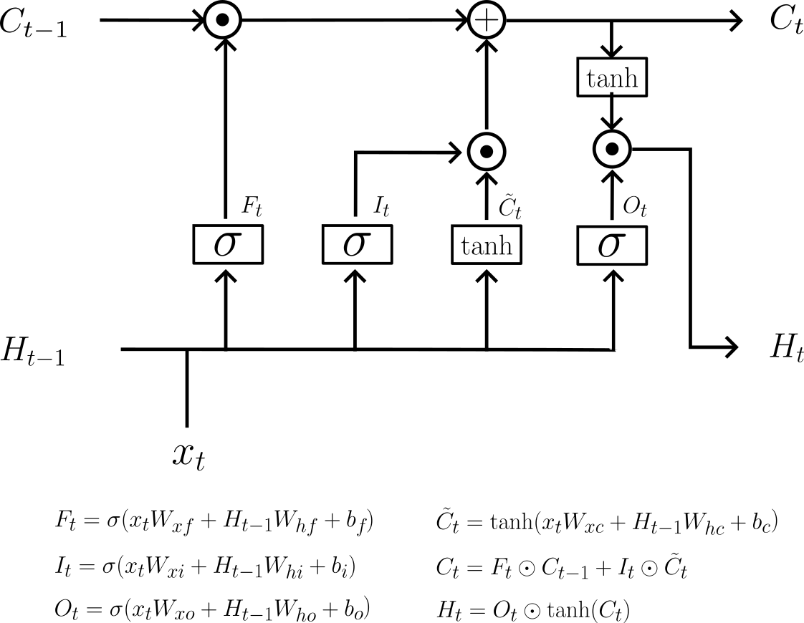

# 神经网络

&emsp;&emsp;神经网络。

## RNN

&emsp;&emsp;循环神经网络。

### LSTM

&emsp;&emsp;RNN的**不足**：RNN层不能学习长期依赖。RNN通过向过去传递“有意义的梯度”，能学习时间方向上的依赖。梯度包含了应该学习到的有意义信息，通过将这些信息向过去传递，RNN层学习到长期依赖。但如果梯度在传递过程中变弱，则权重参数将不会更新。随着时间回溯，这个RNN层不能避免梯度消失或梯度爆炸问题。

&emsp;&emsp;为了解决这类问题，发展出了一种称为LSTM的网络，也称为长短时记忆网络。该模型通过“门机制”解决了长期信息保存和短期输入缺失的问题。以下是模型图概况。

:::{figure-md}
{width=500px}

长短时记忆网络
:::

- **门函数的选择依据**

&emsp;&emsp;因为tanh函数的输出为$[-1,+1]$，可以认为介于这个区间的数值表示“信息”的强弱。而sigmoid函数输出为$[0,+1]$，可以认为是数据流出的比例。因此，在大多数情况下，门函数一般选sigmoid作为激活函数；而包含实质信息的数据则使用tanh作为激活函数。

- **输出门**

&emsp;&emsp;LSTM中，隐状态$H_t$仅对记忆单元$C_t$应用了tanh函数实现信息传递。如果考虑信息的重要性，可以添加一个门管理隐状态$H_t$的输出，这个门就是输出门，即，

$$
O_t = \sigma(x_tW_xo + H_{t-1}W_{ho} + b_o)
$$(output-gate)

因此，隐状态就相应的更新为，

$$
H_t = \underbrace{\text{tanh}(C_t)\odot O_t}_{隐状态与记忆单元的关系}
$$(hidden-state-with-o-gate)

- **遗忘门**

&emsp;&emsp;同理，对于上一时序的记忆单元$C_t$来说，为了去除不必要的记忆元，可以通过遗忘门来实现，即

$$
F_t = \sigma(x_tW_{xf} + H_{t-1}W_{hf} + b_f)
$$(forget-gate)

因此可以得到新记忆单元$C_t$来自于$C_{t-1}$的一部分，即$C_{t-1}\odot F_t$。

- **候选记忆单元**

&emsp;&emsp;遗忘门删除了应该忘记的内容，如果不补充应当记忆的内容，则只会遗忘。为此，就当向$C_t$添加需要记忆的新信息，也就是候选记忆信息，即

$$
\tilde{C}_t = \tanh(x_tW_{xc}+H_{t-1}W_{hc}+b_c)
$$(candidate-memo-cell)

- **输入门**

&emsp;&emsp;候选记忆信息加入记忆单元$C_t$时需取舍，因此可以根据门控机制添加一个输入门来控制，即

$$
I_t = \sigma(x_tW_{xi} + H_{t-1}W_{hi} + b_i)
$$(input-gate)

- **新记忆单元**

&emsp;&emsp;通过上述输入、遗忘操作可以得到新记忆单元，即

$$
C_t=\underbrace{C_{t-1}\odot F_t}_{遗忘部分} +\underbrace{I_t \odot \tilde{C}_t }_{输入部分}
$$(t-memo-cell)