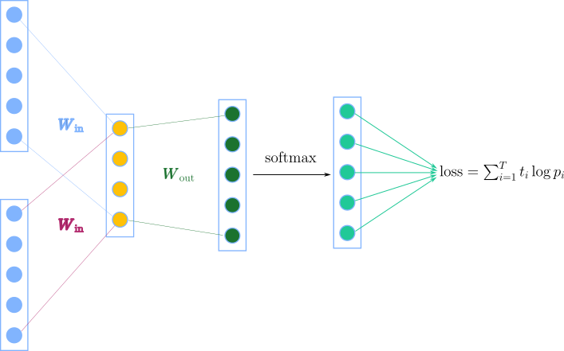
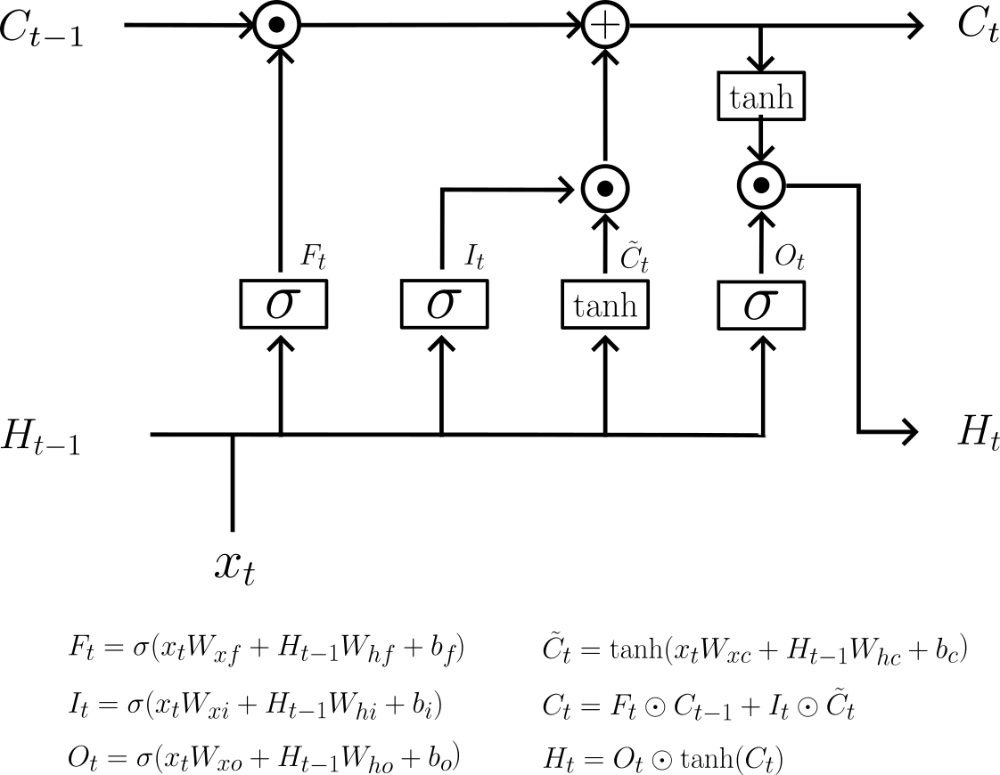

# 循环神经网络

## Word2Vec

&emsp;&emsp;Word2Vec是语言模型的神经网络建模实现。其基本原理如下图所示：

:::{figure-md}
{width=500px}

连续词袋模型的神经网络模型
:::

上图中的模型假设单词向量(one-hot)长度为5，中间层长度为4。训练好之后的输入层与中间层之间的参数$\pmb{W}_{in}$即为所有单词的**词向量**表示。**词向量表示类似于颜色空间的RGB表示**。通过词向量间的运算可以得到类似词与词之间的距离，相似度等效果。例如：“国王 - 男人 + 女人 = 女王”、“猫”靠近“狗”等。 词向量实现了词到向量的转变，可直接迁移至下游任务（文本分类、机器翻译等），‌减少训练成本‌并提升数据集效果。

### 语言模型

&emsp;&emsp;对于给定的单词序列$x_1,x_2,...,x_t$，其出现的概率可以使用联合概率来评估，即

$$
\begin{split}
P(x_1,x_2,...,x_t)&=P(x_t|x_{t-1},...,x_1)P(x_{t-2},...,x_1)...P(x_2|x_1)P(x_1)\\
&=\prod_{i=1}^t P(x_i|x_{i-1},...,x_1)
\end{split}
$$(joint-words-prob)


该式{eq}`joint-words-prob`即为单词序列$x_1,x_2,...,x_t$出现的概率，也称之为**语言模型**。一个理想的语言模型可以根据训练好的式{eq}`joint-words-prob`生成文本。

### CBOW应用于语言模型

&emsp;&emsp;CBOW（Continuous Bag-of-Words，连续词袋模型）是基于上下文单词预测当前中心词的模型，与SKIP正好相反。例如：给定句子“the cat sat on the mat”，若中心词为“sat”，则上下文窗口（假设窗口大小为2）为["the", "cat", "on", "the"]，模型通过聚合这些上下文词的信息预测“sat”。CBOW应用于语言模型是指用固定窗口大小的单词依赖来近似式式{eq}`joint-words-prob`中的后验概率，即

$$
P(x_t|x_{t-1},...,x_1)\approx P(x_t|x_{t-1},x_{t-2},...,x_{t-k+1})
$$(approx-posterior)

其中$k$为固定窗口大小。窗口可以是单边，也可以是双边。以下是CBOW的简单示例。

```python
class SimpleCBOW:
    def __init__(self, vocab_size, hidden_size):
        V, H = vocab_size, hidden_size

        # 初始化权重
        W_in = 0.01 * np.random.randn(V, H).astype('f')
        W_out = 0.01 * np.random.randn(H, V).astype('f')

        # 生成层
        self.in_layer0 = MatMul(W_in)
        self.in_layer1 = MatMul(W_in)
        self.out_layer = MatMul(W_out)
        self.loss_layer = SoftmaxWithLoss()

        # 将所有的权重和梯度整理到列表中
        layers = [self.in_layer0, self.in_layer1, self.out_layer]
        self.params, self.grads = [], []
        for layer in layers:
            self.params += layer.params
            self.grads += layer.grads

        # 将单词的分布式表示设置为成员变量
        self.word_vecs = W_in

    def forward(self, contexts, target):
        h0 = self.in_layer0.forward(contexts[:, 0])
        h1 = self.in_layer1.forward(contexts[:, 1])
        h = (h0 + h1) * 0.5
        score = self.out_layer.forward(h)
        loss = self.loss_layer.forward(score, target)
        return loss

    def backward(self, dout=1):
        ds = self.loss_layer.backward(dout)
        da = self.out_layer.backward(ds)
        da *= 0.5
        self.in_layer1.backward(da)
        self.in_layer0.backward(da)
        return None
```

### 存在的问题

&emsp;&emsp;CBOW用作语言模型存在以下问题：

- **问题1**. 虽然CBOW可以设置任意窗口，但训练时必须使用固定的窗口大小。超过窗口长度的单词将无法作为上下文。

&emsp;&emsp;该问题的一个简单解决方法是将CBOW的中间层拼接。但带来的后果是参数数量与上下文长度成比例增长。

- **问题2**. CBOW忽略了上下文中单词的顺序。

&emsp;&emsp;为了记住上下文，可以使用RNN（Recurrent Neural Network）来实现。无论上下文的长短，RNN都可以记住。


## RNN

&emsp;&emsp;循环神经网络。


## LSTM

&emsp;&emsp;RNN的**不足**：RNN层不能学习长期依赖。RNN通过向过去传递“有意义的梯度”，能学习时间方向上的依赖。梯度包含了应该学习到的有意义信息，通过将这些信息向过去传递，RNN层学习到长期依赖。但如果梯度在传递过程中变弱，则权重参数将不会更新。随着时间回溯，这个RNN层不能避免**梯度消失或梯度爆炸**问题。

&emsp;&emsp;为了解决这类问题，发展出了一种称为LSTM的网络，也称为长短时记忆网络。该模型通过“门机制”解决了长期信息保存和短期输入缺失的问题。以下是模型图概况。

:::{figure-md}
{width=400px}

长短时记忆网络
:::

- **门函数的选择依据**

&emsp;&emsp;因为tanh函数的输出为$[-1,+1]$，可以认为介于这个区间的数值表示“信息”的强弱。而sigmoid函数输出为$[0,+1]$，可以认为是数据流出的比例。因此，在大多数情况下，门函数一般选sigmoid作为激活函数；而包含实质信息的数据则使用tanh作为激活函数。

- **输出门**

&emsp;&emsp;LSTM中，隐状态$H_t$仅对记忆单元$C_t$应用了tanh函数实现信息传递。如果考虑信息的重要性，可以添加一个门管理隐状态$H_t$的输出，这个门就是输出门，即，

$$
O_t = \sigma(x_tW_xo + H_{t-1}W_{ho} + b_o)
$$(output-gate)

因此，隐状态就相应的更新为，

$$
H_t = \underbrace{\text{tanh}(C_t)\odot O_t}_{隐状态与记忆单元的关系}
$$(hidden-state-with-o-gate)

- **遗忘门**

&emsp;&emsp;同理，对于上一时序的记忆单元$C_t$来说，为了去除不必要的记忆元，可以通过遗忘门来实现，即

$$
F_t = \sigma(x_tW_{xf} + H_{t-1}W_{hf} + b_f)
$$(forget-gate)

因此可以得到新记忆单元$C_t$来自于$C_{t-1}$的一部分，即$C_{t-1}\odot F_t$。

- **候选记忆单元**

&emsp;&emsp;遗忘门删除了应该忘记的内容，如果不补充应当记忆的内容，则只会遗忘。为此，就当向$C_t$添加需要记忆的新信息，也就是候选记忆信息，即

$$
\tilde{C}_t = \tanh(x_tW_{xc}+H_{t-1}W_{hc}+b_c)
$$(candidate-memo-cell)

- **输入门**

&emsp;&emsp;候选记忆信息加入记忆单元$C_t$时需取舍，因此可以根据门控机制添加一个输入门来控制，即

$$
I_t = \sigma(x_tW_{xi} + H_{t-1}W_{hi} + b_i)
$$(input-gate)

- **新记忆单元**

&emsp;&emsp;通过上述输入、遗忘操作可以得到新记忆单元，即

$$
C_t=\underbrace{C_{t-1}\odot F_t}_{遗忘部分} +\underbrace{I_t \odot \tilde{C}_t }_{输入部分}
$$(t-memo-cell)

## 自动文本生成

&emsp;&emsp;利用RNN生成文本，其基本原理如下图所示：

:::{figure-md}
{width=300px}

循环神经网络生成文本
:::

&emsp;&emsp;文本生成的主要步骤如下：

1. 语言模型根据已给出的单词序列，输出下一个候选单词的概率分布。

2. 根据步骤1所得到的概率分布，采样生成下一个单词$x_{t+1}$。

3. 将单词$x_{t+1}$输入语言模型，跳到步骤1，直到出现终止字符或满足终止条件。


## Seq2Seq

&emsp;&emsp;Seq2Seq（Sequence to Sequence）模型是一种将一个序列映射到另一个序列的模型结构，广泛用于机器翻译、文本摘要、语音识别等任务。

:::{figure-md}
{width=800px}

Seq2Seq将一个序列映射到另一个序列
:::

Seq2seq的左边为编码器（Encoder），右边为解码器（Decoder），连接的桥梁为$\pmb{h}_t$。其**基本思想**为：编码器读取整个输入序列，压缩为一个“上下文向量”。解码器接收这个向量，然后逐步生成输出序列。如果用 Teacher Forcing，训练时每一步使用真实词作为下一步输入；推理时只能用前一步生成的词。

&emsp;&emsp;其中编码器的主要输入输出为：

- 输入：一个长度为$t_{in}$的输入序列（例如一个英文句子）

- 结构：通常是 RNN、LSTM 或 GRU

- 输出：最后一个隐藏状态（或整个隐藏状态序列），作为输入的“语义表示”

&emsp;&emsp;解码器的主要输入输出为：

- 输入：编码器的输出 + 起始符

- 输出：一个长度为$t_{out}$的输出序列（例如一个法文句子）

- 解码过程是一步一步生成：每一步输出一个词，并作为下一步的输入


## Attention

&emsp;&emsp;传统 Seq2Seq 模型用编码器将整个输入压缩成一个固定向量，这个向量可能会丢失信息，特别是在长序列中。Attention 机制可以让每一步解码时都重新看一遍输入的全部内容，并判断哪些部分重要。